# 1. FishEye

Projet N°6 du parcours _Développeur Front-End_ [OpenClassrooms](https://openclassrooms.com/fr/).


***
- [1. FishEye](#1-fisheye)
  - [1.1. Outils](#11-outils)
    - [1.1.1. Webpack](#111-webpack)
    - [1.1.2. Babel](#112-babel)
    - [1.1.3. ESLint](#113-eslint)
    - [1.1.4. Gestion des modules](#114-gestion-des-modules)
  - [1.2. Organisation des modules JavaScript](#12-organisation-des-modules-javascript)
    - [1.2.1. script](#121-script)
    - [1.2.2. components](#122-components)
  - [1.3. Les types d'objets](#13-les-types-dobjets)
    - [1.3.1. Objet counter](#131-objet-counter)
    - [1.3.2. Objet media et _Factory Method_](#132-objet-media-et-factory-method)
    - [1.3.3. Objet photographer](#133-objet-photographer)
  - [1.4. Accessibilité](#14-accessibilité)
    - [1.4.1. Généralité](#141-généralité)
    - [1.4.2. List box](#142-list-box)
      - [1.4.2.1. Etat initial](#1421-etat-initial)
      - [1.4.2.2. Etat au Focus](#1422-etat-au-focus)
      - [1.4.2.3. Etat étendu](#1423-etat-étendu)
      - [1.4.2.4. construction **HTML**](#1424-construction-html)
    - [1.4.3. Compteur de Like](#143-compteur-de-like)
      - [1.4.3.1. Fonctionnement général](#1431-fonctionnement-général)
      - [1.4.3.2. Etat au Focus](#1432-etat-au-focus)
    - [1.4.4. Tags](#144-tags)
      - [1.4.4.1. Construction **HTML** et **CSS**](#1441-construction-html-et-css)
      - [1.4.4.2. Etat au Focus](#1442-etat-au-focus)
    - [1.4.5. Sous-titres](#145-sous-titres)
      - [1.4.5.1. Déclaration HTML](#1451-déclaration-html)
      - [1.4.5.2. Fichier _.vtt_](#1452-fichier-vtt)
    - [1.4.6. Vignette photographe](#146-vignette-photographe)
      - [1.4.6.1. Zone de _Focus_](#1461-zone-de-focus)
    - [1.4.7. Modal Formulaire de contact](#147-modal-formulaire-de-contact)
      - [1.4.7.1. Rôle et attributs ***ARIA***](#1471-rôle-et-attributs-aria)
      - [1.4.7.2. Input et gestion des erreurs](#1472-input-et-gestion-des-erreurs)
      - [1.4.7.3. Navigation au clavier et respect de **WAI-ARIA**](#1473-navigation-au-clavier-et-respect-de-wai-aria)
    - [1.4.8. Modal Light Box](#148-modal-light-box)
  - [1.5. Validité du code](#15-validité-du-code)
    - [1.5.1. HTML et CSS valide W3C](#151-html-et-css-valide-w3c)
    - [1.5.2. Accessibility checker](#152-accessibility-checker)

***

## 1.1. Outils

L'intégration du site a été réalisée en **HTML5**, **CSS3** et **JavaScript** sans framwork.

### 1.1.1. Webpack


Le projet étant constitué de différentes classes et de nombreuses fonctionnalités développées en **Javascript**, le découpage du code en _modules_ a été nécessaire (permetant ainsi une meilleur organisation du code et rendant la maintenance plus aisée).   
Le _bundler_ **webpack** a permit de regrouper ces différents modules en un seul fichier lisible par les navigateurs.

_fichier de configuration  de **webpack** ci-dessous :_  
[_webpack.confi.js_](./webpack.config.js)

### 1.1.2. Babel


L'utilisation d'un _transpiler_ tel que **Babel** a permit de coder les fonctionnalités de l'application avec du **JavaScript** moderne (ES6) en le rendant _"compréhensible"_ par la plupart des navigateurs.

### 1.1.3. ESLint


Le _linter_ **ESLint** à aidé à conserver une cohérence dans la programmation et à respecter les bonnes pratiques de developpement en **JavaScript**.

_fichier de configuration  de **ESLint** ci-dessous :_  
[_.eslintrc.json_](./.eslintrc.json)

### 1.1.4. Gestion des modules


Nous pouvons retrouver la totalité des dépendances de développement dans le fichier [_package.json_](./package.json)

***

## 1.2. Organisation des modules JavaScript

### 1.2.1. script

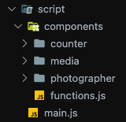

Le dossier _script_ contient la totalité du code **JavaScript** et se compose d'un dossier regroupant les composants de l'application, et d'un fichier _main.js_ qui est le point d'entré du _bundler_.

### 1.2.2. components

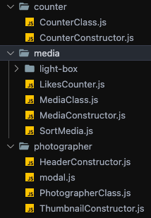

***Note :***  
Dans ce projet, a été utilisé du javascript moderne. L'instanciation de fonctions de type _factory functions_ a permis de créer les objets.

Chaque dossier se trouvant dans _components_ représente un type d'objet.  
Dans chaque dossier d'objet, se trouve :

  - Un fichier se terminant par _***Class.js_ qui contient la _factory function_ permettant de définir les spécificités de notre objet ains que les méthodes qui lui sont associées.
  - Un fichier se terminant par _***Constructor.js_ contenant la fonction _"build"_ qui collectera dans un premier temps les données nécessaires dans le fichier _data-base.json_, puis instanciera la _factory function_ pour créer notre objet et lui appliquer ses méthodes.
  - Les autres dossiers ou fichiers que l'on peut y trouver sont des fonctionnalités indirectement rattachées aux objets et/ou trop complexes pour être définies en _méthodes_.  
  Exemples : _LikesCounter.js_ qui permet de _"liker"_ les photos ou bien _modal.js_ qui concerne les photographes mais pas l'objet _photographer_ en lui même.

***

## 1.3. Les types d'objets

### 1.3.1. Objet counter

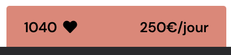

_counter_ est l'objet qui représente le nombre total de "likes" d'un photographe ainsi que ses tarifs.

_exemple:_

```js
export const createCounter = (likes, price, uiNode) => {

  const displayCounter = () => {
    uiNode.innerHTML += `
      <div class="layout__total-heart">
        <p class="count__like">${likes}</p>
        <span class="fas fa-heart"></span>
      </div>
      <p class="count__price">${price}</p>
    `;
  };

  return {
    likes,
    price,
    uiNode,
    displayCounter
  };

};
```

Dans cet exemple, pour fabriquer un nouvel objet _Counter_, nous ferons:

```js
const myCounter = createCounter(a, b, c);
```

Et ainsi afficher notre objet _myCounter_ grâce à la méthode _.displayCounter()_

```js
myCounter.displayCounter();
```

### 1.3.2. Objet media et _Factory Method_

L'objet _media_ représente les photos et les vidéos.  
Afin de gérer le comportement différent de ces médias qui sont pourtant issus de l'instanciation de la même fonction d'usine, le _Desing pattern_ => _Factory Method_ a été utilisé.

Nous avons deux types d'objet : Image et vidéo.
Donc deux _factory functions_ vont pouvoir fabriquer ces objets avec leurs spécificités :

Objet Image :

```js
 const createImage = (a, b, c) => {

    const affichageDuMedia = () => {

      uiNodeToInject.innerHTML += `
        <code HTML avec ${a, b, c}>
      `;

    };

    return {
      a,
      b,
      c,
      affichageDuMedia
    };

  };
```

Objet Video :

```js
 const createVideo = (a, y, c) => {

    const affichageDuMedia = () => {

      uiNodeToInject.innerHTML += `
        <code HTML avec ${a, y, c}>
      `;

    };

    return {
      a,
      y,
      c,
      affichageDuMedia
    };

  };
```

Les deux objets de type _média_ sont différents mais ont une méthode d'affichage portant le même nom.

La distinction et la création de ces _objets médias_ de type _Image_ ou _Video_ sera confiée à la méthode _.fabricationDeMedia()_ appliquée à un objet _"usine de médias"_ instancié de _createMediaFactory()_ :

```js
const createMediaFactory = (donnéesDuMedia) => {

  const fabricationDeMedia = () => {

    let media;

    switch (mediaType) {
      case 'image':
        media = createImage(a, b, c);                  );
        break;
      case 'video':
        media = createVideo(a, y, c);
        break;
    }
    return media;
  };

  return {
    donnéesDuMedia,
    fabricationDeMedia
  };

};
```

Ainsi pour créer et afficher le média quel que soit son type, nous créons premièrement notre objet _usine_ :
```js
const monUsineDeMedia = createMediaFactory(donnéesDuMedia)
```

Le média _"nouveauMedia"_ sera généré grâce à notre usine _"monUsineDeMedia"_ qui suivra le processus de fabrication adéquat défini par la méthode _.fabricationDeMedia()_ :

```js
const nouveauMedia = monUsineDeMedia.fabricationDeMedia()
```

Les objets de type _média_ implémentent différement la méthode d'affichage : 

```js
nouveauMedia.affichageDuMedia()
```

### 1.3.3. Objet photographer

L'objet _photographer_ instancié par la fonction _createPhotographer()_ apparait dans le projet sous forme de : 

- Vignette dans la page d'accueil grâce à la méthode .displayPhotographerThumbnail()

  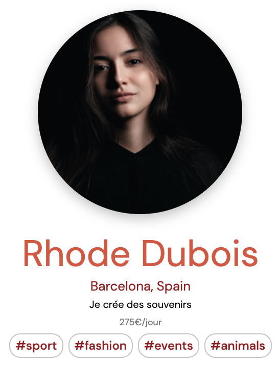

- Header dans chaque page de photographe grâce à la méthode .displayPhotographerHeader()

  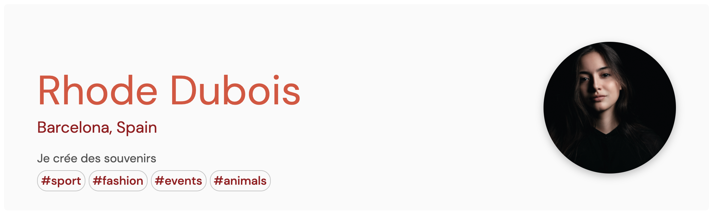

***

## 1.4. Accessibilité

### 1.4.1. Généralité

Les gestionnaires d'événements _JavaScript_ (voir ci-dessous) permettent d'interagir avec tous les éléments de l'application grâce au clavier à l'aide des touches `Enter` et/ou `Space`.

```js
element.addEventListener('keydown', e => {
  if (e.key === 'Enter' || e.code === 'Space') {
    e.preventDefault();
    function();
  }
});
```

### 1.4.2. List box

#### 1.4.2.1. Etat initial

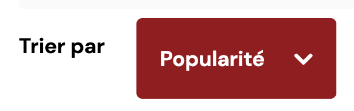

```html
  <p id="sort-by" class="production__navigation-paragraph">Trier par</p>
  <button class="button production__navigation-trigger" aria-labelledby="sort-by"
  aria-haspopup="listbox" aria-expanded="false" type="button">Popularité</button>
```

Le _trigger_ de la liste de choix (qui définit l'ordre d'affichage des médias) est un élément de type `button`.  
Il est nommé grâce à `aria-labelledby="sort-by"` et le relie au paragraphe le précédant par son _ID_.  
`aria-haspopup="listbox"` déclare que le bouton contrôle une liste de choix et `aria-expanded="false"` indique que cette liste n'est pas étendue.

#### 1.4.2.2. Etat au Focus

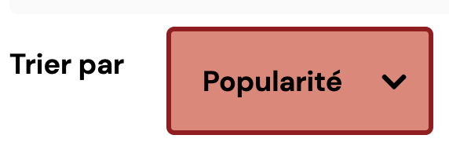

Le code **CSS** suivant permet une mise en évidence clairement visible de l'élément au _focus_ respectant les niveaux de contrastes définis par la norme **AA** de la **WCAG** :

```css
&:focus {
    border: 3px solid $primary-color;
    background-color: $tertiary-color;
    color: #000000;
    outline: none;
  }
```

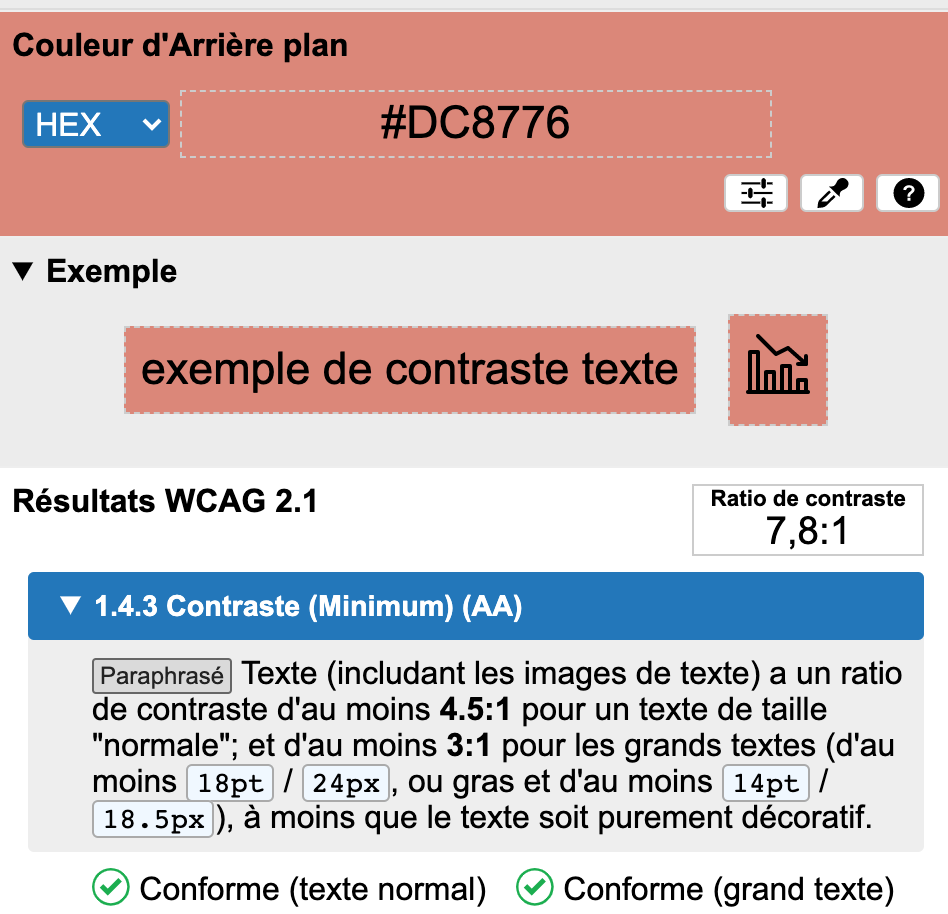

_Note :_ Cette typographie sera utilisée pour tous les éléments interactifs de l'application prenant le _Focus_.

#### 1.4.2.3. Etat étendu

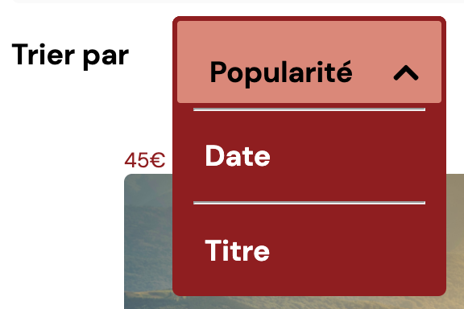

Le code _Javascript_ ci-dessous permet d'étendre la liste de choix et de porter directement le _focus_ sur la première option.

```js
uiNodeTrigger.addEventListener('click', () => {
    uiNodeOptionsList.style.display = 'block';
    uiNodeTrigger.setAttribute('aria-expanded', 'true');
    document.querySelector('li.item--first').focus();

  });
```

Afin de respecter la norme **WCAG**, le _trigger_ a maintenant le statut ```aria-expanded="true"```

#### 1.4.2.4. construction **HTML**

```html
<ul class="production__navigation-optionslist" role="listbox">
  <li id="option-popularite" class="button item item--first js-sorting" tabindex="0" role="option">Popularité</li>
  <hr>
  <li id="option-date" class="button item js-sorting" tabindex="0" role="option">Date</li>
  <hr>
  <li id="option-titre" class="button item js-sorting" tabindex="0" role="option">Titre</li>
</ul>
```

Le rôle `role="listbox"` définit la liste `ul` comme étant la liste de choix.  
Chaque élément `li` a le rôle `role="option"` le rattachant au rôle de son parent et possède un attribut ```tabindex="0"``` permettant _d'accrocher_ le _focus_ et ainsi naviguer dans cette liste grâce au clavier.

***

### 1.4.3. Compteur de Like

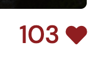

#### 1.4.3.1. Fonctionnement général

```html
<i class="fas fa-heart" tabindex="0" role="button" aria-label="Likes" data-photo-id="${id}"></i>
```

L'image de coeur générée par [Font Awesome](https://fontawesome.com/) remplit le rôle de `button` permettant d'incrémenter le nombre total de mentions _j'aime_ dans le fichier [data_base.json](./data_base.json) grâce à l'_API **Fetch**_ et à sa méthode _put_.  
Voir fichier [LikesCounter.js](./script/components/media/LikesCounter.js)

#### 1.4.3.2. Etat au Focus

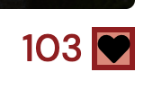

***

### 1.4.4. Tags

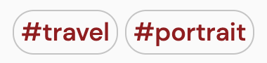

#### 1.4.4.1. Construction **HTML** et **CSS**

```html
<div class="js-tags" role="link" tabindex="0">
  <span class="sr-only">Tag</span>
  <span class="tag">Art</span>
</div>
```

Chaque _Tag_ est construit dans une `div`, a un rôle `link`, et prend le _focus_ grâce à l'attribut `tabindex`.  
Le mot _Tag_ dans la première `span` ne sera lu que par les lecteurs d'écran et permettra de renseigner les personnes malvoyantes.  
La classe `sr-only` permet de cacher visuellement ce mot grâce au code **CSS** suivant :

```css
.sr-only {
  border: 0;
  clip: rect(0 0 0 0);
  height: 1px;
  margin: -1px;
  overflow: hidden;
  padding: 0;
  position: absolute;
  width: 1px;
 }
 ```

 #### 1.4.4.2. Etat au Focus

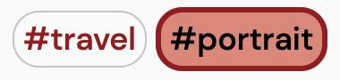

***

### 1.4.5. Sous-titres


Toutes les vidéos présentes dans l'application sont dotées de sous-titres en français et en anglais.  
Un même texte explicatif renseigne l'utilisateur que les vidéos sont purement visuelles et artistiques et n'ont pas de bande sonore.

#### 1.4.5.1. Déclaration HTML

```html
<video controls="" data-video-id="394583434" tabindex="0">
  <source src="./images/Sample-Photos/Nabeel/Travel_Rock_Mountains.mp4" type="video/mp4">
  <track kind="captions" src="./images/subtitleFR.vtt" label="french" srclang="fr">
  <track kind="captions" src="./images/subtitleEN.vtt" label="english" srclang="en">
  Le fichier vidéo ne peut pas être lu
</video>
```

#### 1.4.5.2. Fichier _.vtt_

```
WEBVTT

00:00:00.000 --> 00:00:30.000
Vidéo artisitique sans bande sonore ...
```

***

### 1.4.6. Vignette photographe

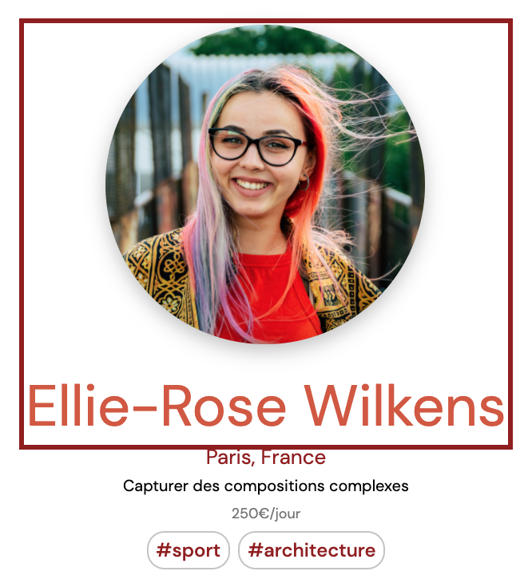

Les vignettes de chaque photographe reçoivent le _Focus_ sur l'image et le titre `h2`.

#### 1.4.6.1. Zone de _Focus_

```html
<a class="layout__photo-name" href="photographer.html?${id}" aria-labelledby="${id}">
  <div class="thumbnail__portrait">
    
  </div>
  <h2 class="thumbnail__name" id="${id}">${name}</h2>
</a>
```

Une fonction **JavaScript** définira la valeur de l'attribut `aria-labelledby` du lien afin de renseigner l'utilisateur malvoyant.

***

### 1.4.7. Modal Formulaire de contact

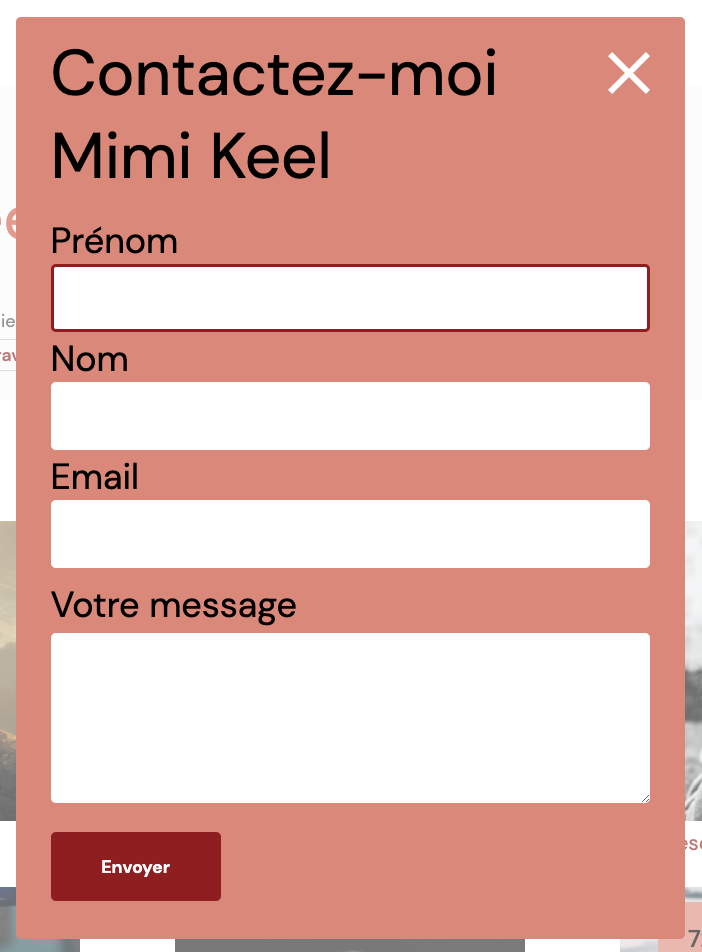

#### 1.4.7.1. Rôle et attributs ***ARIA***

La _modal_ a pour rôle `dialog` et un attribut `aria-hidden` dont la valeur passera de `true` à `false` à son ouverture (la gestion des états est effectuée en **JavaScript**).  
`aria-modal="true"` indique que la `div` est une _modal_.  
`aria-labelledby="contact photographe"` labélise le formulaire grâce aux titres `h1` et `h2`.

```html
<div class="form-content" role="dialog" aria-hidden="true" aria-modal="true" aria-labelledby="contact photographe">
  <svg tabindex="0" role="button" aria-label="Fermer le formulaire" viewBox="0 0 42 42">
    <path
      d="M42 4.23L37.77 0L21 16.77L4.23 0L0 4.23L16.77 21L0 37.77L4.23 42L21 25.23L37.77 42L42 37.77L25.23 21L42 4.23Z"
      />
  </svg>
  <h1 class="form-content__title" id="contact">Contactez-moi</h1>
  <h2 class="form-content__photographer" id="photographe"></h2>
```

#### 1.4.7.2. Input et gestion des erreurs

Les champs obligatoires sont signalés par l'attribut `aria-required="true"`

```html
<form novalidate>
  <div class="form__field" id="firstName">
    <label for="prenom">Prénom</label>
    <input id="prenom" aria-required="true">
  </div>
```

En cas de mauvaise saisie, un message d'erreur apparait au dessous du champ concerné,

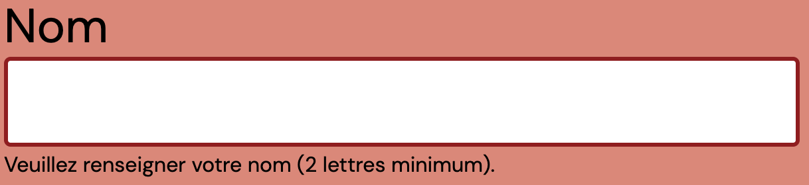

et une fonction **JavaScript** ajoutera l'attribut `aria-invalid="true"` à la balise `input` afin de renseigner les lecteurs d'écran.

```html
<div class="form__field" id="firstName" data-error-visible="true" data-error="Veuillez renseigner votre prénom (2 lettres minimum).">
  <label for="prenom">Prénom</label>
  <input id="prenom" aria-required="true" aria-invalid="true">
</div>
```

#### 1.4.7.3. Navigation au clavier et respect de **WAI-ARIA**

Comme l'indique **w3.org** [ici](https://www.w3.org/TR/wai-aria-practices-1.1/examples/dialog-modal/dialog.html), les éléments suivants ont été repectés afin de naviguer au clavier dans la _modal_ :

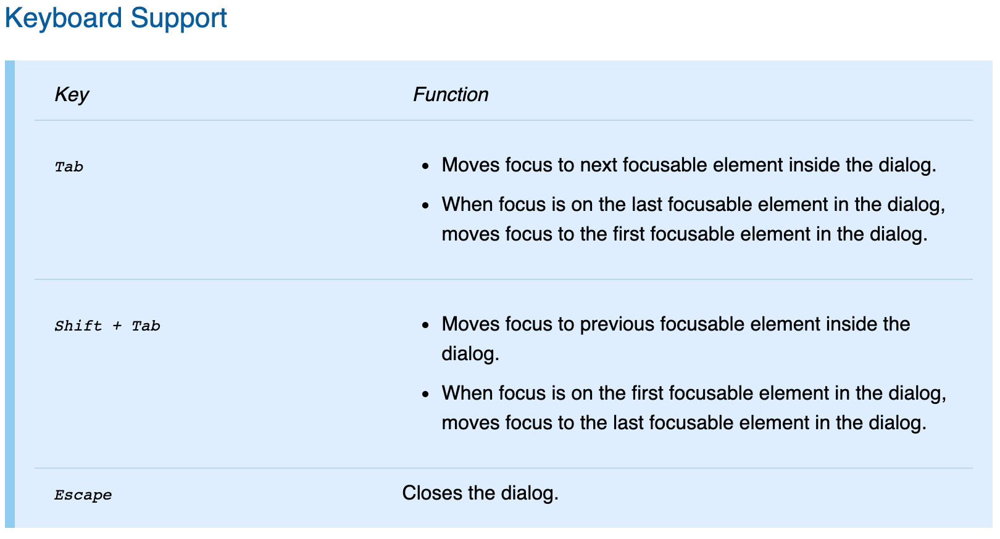

Note : Le formulaire dans sa globalité, la gestion des erreurs, l'enfermement de la tabulation et l'affichage des données utilisateur dans la console sont gérés en **JavaScript** dans le module [modal.js](./script/components/photographer/modal.js)

***

### 1.4.8. Modal Light Box

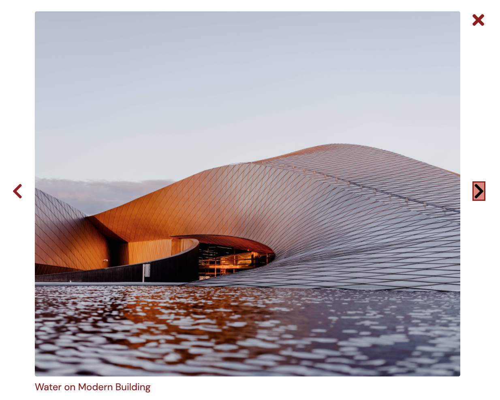

La _light box_ étant une _modal_ tout comme le formulaire de contact, les regles en termes d'accessibilité ont été les mêmes, ainsi que les changements de valeurs des attributs **_ARIA_**.

Les fichiers **JavaScript** gérant le fonctionnement de la _modal_ se trouvent dans le repertoire [light-box](./script/components/media/light-box).

***

## 1.5. Validité du code

### 1.5.1. HTML et CSS valide W3C

Toutes les pages **HTML** et **CSS** ont été testées et sont valides.

[Test CSS validator.w3.org](https://jigsaw.w3.org/css-validator/)


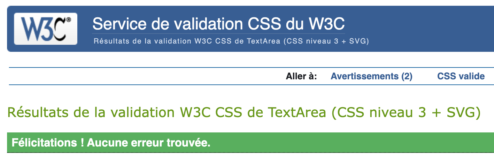

[Test HTML validator.w3.org](https://validator.w3.org/)

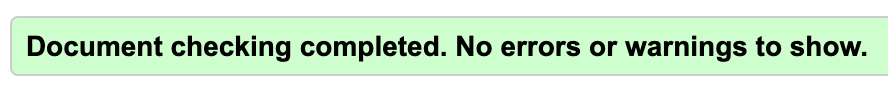

### 1.5.2. Accessibility checker


le contrôle de [AChecker](https://achecker.achecks.ca/checker/index.php) en terme d'accessibilité ne relève aucune erreur.

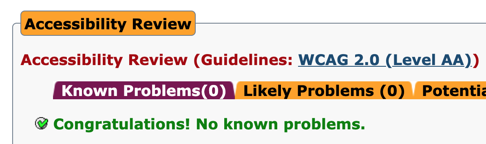

***
